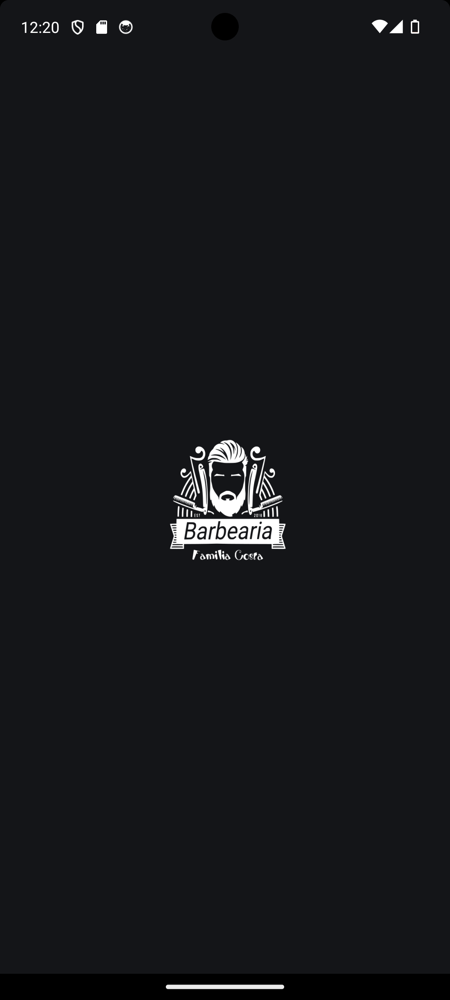

# React Native Weather App

This is a React Native app for barbershop scheduling.

### Setup Environment

Project created with React Native CLI.[ See official docs](https://reactnative.dev/docs/environment-setup) to set up the environment.

<!-- **Env Variables**

Create a file called .env in the root of the project with the following variables:

```
HERE_API_KEY=
WEATHER_API_KEY=
``` -->

<!-- There is an example in [.env.example](./.env.example). **You need request the keys to the project owner**. -->

### Run

**Install dependencies**

```
yarn
```

**Install IOS Pods**

```
cd ios && pod install
```

**Run IOS**

```
yarn ios
```

**Run Android**

```
yarn android
```

**Run Tests**

```
yarn test
```

### 🛠 Tech and Libraries

- [React Native](https://reactnative.dev/)
- [TypeScript](https://www.typescriptlang.org/)
- [React Navigation](https://reactnavigation.org/): Routing and navigation
- [Axios](https://github.com/axios/axios): Promise based HTTP client
- [React Query](https://react-query.tanstack.com/): Fetching, caching, synchronizing and updating server state.
- [restyle](https://shopify.github.io/) for theme and build UI

### App Screenshots

|                        |                       Android                        | IOS                                      |
| :--------------------: | :--------------------------------------------------: | ---------------------------------------- |
|     Splash Screen      |           |       |
|      Home Screen       |             |         |
|   Barbershop Screen    |       |       |
| Barbershop Info Screen |  |  |
